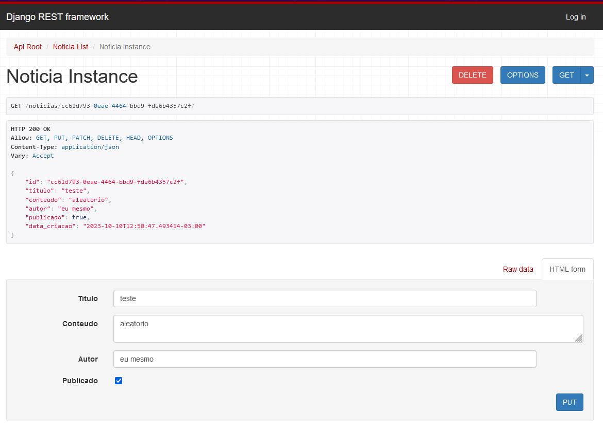
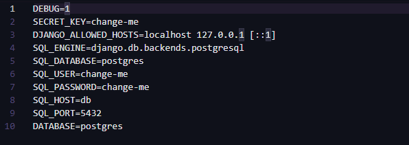
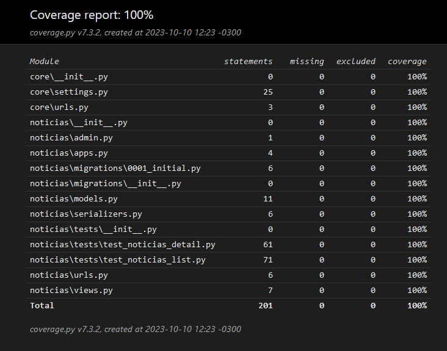

# API de Notícias

A API possui os seguintes endpoints:

- **Listagem de Notícias:** `GET /noticias/` - Lista todas as notícias disponíveis.

- **Visualização de Notícia por ID:** `GET /noticias/{uuid}/` - Retorna os detalhes de uma notícia específica pelo seu UUID.

- **Cadastro de Notícia:** `POST /noticias/` - Cria uma nova notícia enviando um JSON com os detalhes da notícia.

- **Edição de Notícia:** `PUT /noticias/{uuid}/` ou `PATCH /noticias/{uuid}/` - Atualiza os detalhes de uma notícia existente pelo seu UUID.

- **Remoção de Notícia:** `DELETE /noticias/{uuid}/` - Exclui uma notícia específica pelo seu UUID.

<br>



## Configuração

Antes de executar a aplicação, você precisa configurar o ambiente:

1. Configure as variáveis de ambiente renomeando o arquivo `.env-example`. para `.env` e defina as variáveis de ambiente substituindo os valores 'change-me' deacordo com o docker-compose.yml



## Executando a Aplicação

Navegue para a pasta `django_app` executando o seguinte comando:

```bash	
cd django_app
```
Para iniciar o servidor de desenvolvimento, execute o seguinte comando:

```bash
python manage.py runserver
```

Acesse a API em `http://localhost:8000/noticias/` no seu navegador ou usando uma ferramenta como [curl](https://curl.se/).

## Testes

A aplicação é testada usando pytest e possui 100% de cobertura de código. 


Para executar os testes, execute o seguinte comando:

```bash
pytest
```

## Docker

Você pode executar a aplicação em um contêiner Docker usando o Docker Compose.

Para iniciar os contêineres, execute:

```bash
docker-compose up -d --build
```

Isso iniciará a aplicação e o banco de dados PostgreSQL em contêineres separados.


## Licença

Este projeto está licenciado sob a Licença MIT. Consulte o arquivo [LICENSE](LICENSE) para obter mais detalhes.